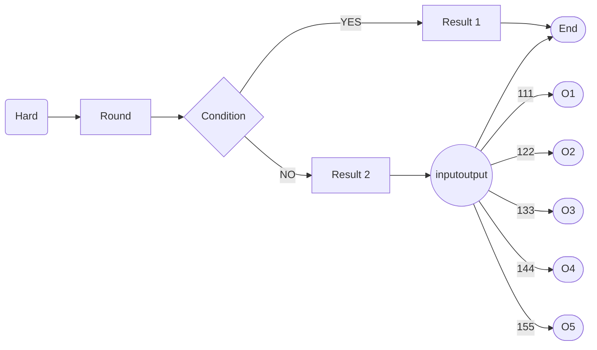

```mermaid
flowchart LR
A!(Hard)
B[Round]
C{Condition}
H((inputoutput))
D[Result 1]
E[Result 2]
O1([O1])
O2([O2])
O3([O3])
O4([O4])
O5([O5])
G([End])

A! --> B --> C -->|YES|D
C -->|NO| E-->H-->G
D -->G
H --> |111|O1
H --> |122|O2
H --> |133|O3
H --> |144|O4
H --> |155|O5
```